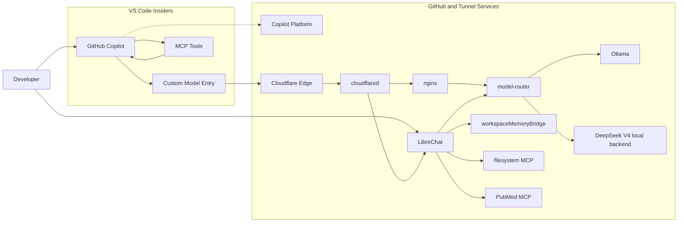

# AI Tunnel Example Repo

This repo provides a working example scaffold for exposing a self-hosted local-model stack through Cloudflare Tunnel, fronting it with Nginx and a local model-router, and consuming it from VS Code Insiders through GitHub Copilot's OpenAI-compatible bring-your-own-model path. The shared model catalog is set up for a small team running Ollama models plus optional local DeepSeek V4 through a dedicated inference overlay.

## What This Stack Does

- runs Ollama privately on the internal Docker network
- routes OpenAI-compatible requests through a local model-router to locally served model backends
- fronts the router with Nginx
- protects the machine API route with bearer-token auth loaded from file
- optionally protects the admin hostname with Nginx Basic Auth loaded from file
- publishes the Nginx service through Cloudflare Tunnel
- optionally runs LibreChat as a team web UI beside the machine API path
- gives LibreChat access to local workspace memory and a read-only repo filesystem MCP service
- adds PubMed research MCP services for general research, systematic reviews, and research-trend analysis
- ships a shared model catalog with Qwen, Gemma, legacy local DeepSeek/Ollama, and local DeepSeek V4 profiles
- keeps configuration in `.env`, using [example.env](example.env) as the contract

## Architecture

Machine API traffic flow:

`Cloudflare -> cloudflared -> nginx -> model-router -> ollama`

When [compose.deepseek-v4.yaml](compose.deepseek-v4.yaml) is enabled, `model-router` can also route to the local `deepseek-v4` OpenAI-compatible backend.

LibreChat traffic flow when [compose.librechat.yaml](compose.librechat.yaml) is enabled:

`Cloudflare -> cloudflared -> librechat -> model-router -> ollama`

With the DeepSeek V4 overlay enabled, LibreChat still uses the same `model-router` endpoint and discovers local V4 aliases from there.

The API and admin surfaces are intentionally split:

- `OLLAMA_API_HOSTNAME` is the machine-facing route for VS Code and other API clients
- `OLLAMA_ADMIN_HOSTNAME` is the human-facing route for diagnostics and optional Basic Auth access
- `LIBRECHAT_HOSTNAME` is the human-facing chat UI route, protected by LibreChat user accounts

This matters because VS Code Insiders expects an API endpoint and API key for OpenAI-compatible models. A browser-style login flow in front of `/v1` would be the wrong fit.

## Stack Diagram



Operational split:

- model inference goes through `Cloudflare -> cloudflared -> nginx -> model-router -> ollama` or the optional local `deepseek-v4` backend
- LibreChat browser sessions go through `Cloudflare -> cloudflared -> LibreChat`, then model requests stay internal at `LibreChat -> model-router`
- MCP tool calls are separate from the Ollama inference path and stay attached to Copilot in VS Code
- LibreChat MCP tool calls stay on the internal Docker network and do not go through Nginx
- PubMed MCP services read `../ai-tunnel-secrets/pubmed-mcp.env` for NCBI and Unpaywall configuration
- Copilot platform features like sign-in, policy, indexing, and side requests still exist alongside the custom model path

## Default Model And Shared Catalog

The default model profile for this repo is `Qwen 2.5 3B (Chat + Agent)`.

The current example uses this Ollama package as the backing model:

- display name: `Qwen 2.5 3B (Chat + Agent)`
- actual Ollama model id: `qwen2.5:3b`

Important distinction:

- the display name shown in VS Code can be friendlier than the backing package name
- the model id sent over the OpenAI-compatible API must match the Ollama model id unless you add a translation layer

The router now owns the model surface. Ollama-backed entries still use their actual Ollama tags, while DeepSeek V4 uses router-facing local aliases such as `deepseek-v4-flash` and `deepseek-v4-pro`.

The router catalog in [models/catalog.json](models/catalog.json) includes local Ollama profiles and these local DeepSeek V4 aliases:

- `deepseek-v4-flash`
- `deepseek-v4-pro`

DeepSeek V4 is not a remote provider in this stack. It is served by [compose.deepseek-v4.yaml](compose.deepseek-v4.yaml) through SGLang and uses `../ai-tunnel-secrets/deepseek-v4.env` only for local model-download credentials such as `HF_TOKEN`.

The shared workspace catalog in [.vscode/settings.json](.vscode/settings.json) also includes these local Gemma 4 weight profiles as separate model entries:

- `gemma4:e2b`
- `gemma4:e4b`
- `gemma4:26b`
- `gemma4:31b`

This repo pins `gemma4:e4b` as the convenience Gemma profile for pull, register, smoke-test, and optional tool-probe tasks. The larger Gemma 4 variants stay selectable through the shared catalog and can be pulled on machines that fit them.

## Repo Layout

```text
.
|-- README.md
|-- example.env
|-- compose.yaml
|-- compose.librechat.yaml
|-- compose.deepseek-v4.yaml
|-- compose.gpu.yaml
|-- compose.amd.yaml
|-- compose.vulkan.yaml
|-- models/
|   `-- catalog.json
|-- mempalace.yaml
|-- librechat/
|   `-- librechat.yaml
|-- mcp/
|   |-- filesystem-gateway/
|   |   `-- Dockerfile
|   `-- workspace-memory-bridge/
|       `-- Dockerfile
|-- docs/
|   `-- vscode-insiders-setup.md
|-- nginx/
|   |-- nginx.conf
|   |-- conf.d/
|   |   `-- ollama.conf.template
|   `-- entrypoint/
|       `-- render-config.sh
`-- scripts/
    |-- bootstrap-workspace-memory.py
    |-- bootstrap-secrets.py
    |-- bootstrap-vscode-user.py
    |-- check-accel.py
    |-- lock-librechat-registration.py
    |-- rotate-api-token.py
    |-- smoke-test.ps1
    `-- smoke-test.sh
```

## Required Secrets

Create a sibling `ai-tunnel-secrets` directory one level up from the repo:

```text
../ai-tunnel-secrets/
|-- cloudflared-token
|-- deepseek-v4.env
|-- librechat.env
|-- nginx-admin-password
|-- ollama-api-token
|-- pubmed-mcp.env
`-- nginx-htpasswd
```

Secret usage:

- `cloudflared-token` is mounted into the `cloudflared` container and used as the tunnel token file
- `deepseek-v4.env` is mounted only into the local DeepSeek V4 inference container and stores optional Hugging Face download credentials
- `librechat.env` is generated by the bootstrap helper and stores LibreChat app, auth, MeiliSearch, and RAG/vector DB secrets
- `nginx-admin-password` is the plaintext source of truth for admin Basic Auth
- `ollama-api-token` is read by Nginx and enforced on the API hostname
- `pubmed-mcp.env` stores the optional NCBI API key, NCBI contact email, and Unpaywall contact email used by PubMed MCP services
- `nginx-htpasswd` is the derived hash file used only when `ENABLE_ADMIN_BASIC_AUTH=true`

## Quick Start

Fast path for a fresh clone:

1. Copy [example.env](example.env) to `.env` and update the public hostnames.
2. Run the secrets bootstrap so the sibling `../ai-tunnel-secrets` directory and local token files exist.
3. Start the stack and pull the default local chat/agent model.
4. Bootstrap VS Code user settings so Copilot sees the `AI Tunnel` provider.
5. If you want LibreChat, start the LibreChat overlay, create the first admin locally, then lock public registration before publishing the LibreChat hostname.
6. If you want Gemma locally as well, pull or register the pinned `gemma4:e4b` profile, or add another Gemma 4 weight profile through the generic model tasks.
7. On a GPU server that can host DeepSeek V4, start the local DeepSeek V4 overlay.
8. Run the smoke tests.

Known small proof model:

- `qwen2.5:0.5b` is now wired in as a tiny local smoke model for quick chat-only stack checks when you want a fast local deployment before pulling anything larger
- it is intentionally kept in the `local-smoke` router profile, not the default `local-small` LibreChat selector profile, because it is not reliable for MCP/tool-calling chats
- `qwen2.5:3b` is the smallest model currently verified in this repo to prove the full Nginx-backed OpenAI-compatible path end to end, including `scripts/check_tool_calling.py`
- use it when you want to prove the stack before starting a larger local DeepSeek V4 backend
- `gemma4:e4b` is the pinned Gemma 4 convenience profile for this repo; treat the other Gemma 4 tags as separate weight-profile entries instead of aliases for the same model

Windows PowerShell:

```powershell
Copy-Item example.env .env
py -3 scripts/bootstrap-secrets.py --env-file .env
docker compose --env-file .env up -d
docker compose --env-file .env --profile init run --rm ollama-pull
# Optional LibreChat web UI and RAG embeddings model.
docker compose -f compose.yaml -f compose.librechat.yaml --env-file .env up -d
docker compose -f compose.yaml -f compose.librechat.yaml --env-file .env --profile init run --rm ollama-pull-librechat-embeddings
# Optional: pull the full local workspace catalog instead of only the default model.
py -3 scripts/pull_all_models.py --env-file .env --settings-file .vscode/settings.json
py -3 scripts/bootstrap-vscode-user.py --env-file .env --copy-api-key
# Optional local DeepSeek V4 backend. Requires suitable GPU hardware and local weights.
docker compose -f compose.yaml -f compose.deepseek-v4.yaml --env-file .env up -d
./scripts/smoke-test.ps1 --chat
./scripts/smoke-test.ps1 --tool-calling
```

POSIX shell:

```sh
cp example.env .env
python3 scripts/bootstrap-secrets.py --env-file .env
docker compose --env-file .env up -d
docker compose --env-file .env --profile init run --rm ollama-pull
# Optional LibreChat web UI and RAG embeddings model.
docker compose -f compose.yaml -f compose.librechat.yaml --env-file .env up -d
docker compose -f compose.yaml -f compose.librechat.yaml --env-file .env --profile init run --rm ollama-pull-librechat-embeddings
# Optional: pull the full local workspace catalog instead of only the default model.
python3 scripts/pull_all_models.py --env-file .env --settings-file .vscode/settings.json
python3 scripts/bootstrap-vscode-user.py --env-file .env --copy-api-key
# Optional local DeepSeek V4 backend. Requires suitable GPU hardware and local weights.
docker compose -f compose.yaml -f compose.deepseek-v4.yaml --env-file .env up -d
./scripts/smoke-test.sh --chat
./scripts/smoke-test.sh --tool-calling
```

Task-first alternative in VS Code:

1. Run `Stack: Bootstrap Secrets`.
2. Run `Stack: Start Local Services`.
3. Run `Stack: Pull Default Model`.
4. If you want LibreChat, run `Stack: Start Local Services + LibreChat` and `LibreChat: Pull RAG Embeddings Model`.
5. If you want the entire shared local catalog on disk, run `Stack: Pull All Local Models`.
6. Run `VS Code: Bootstrap User Space + Copy API Key`.
7. If you want a tiny local chat sanity check first, run `Models: Pull + Register Local Smoke Model (qwen2.5:0.5b)` and then `Stack: Smoke Test Local Smoke Model (qwen2.5:0.5b)`.
8. If you want a small end-to-end tool-calling proof next, run `Models: Pull + Smoke Test Proof Model (qwen2.5:3b)`.
9. If you want the pinned Gemma path, run `Models: Pull + Register Gemma 4 E4B` and then `Models: Pull + Smoke Test Gemma 4 E4B`.
10. Run `Stack: Start Local Services + DeepSeek V4` when you are ready to validate the local DeepSeek V4 backend.
11. Run `Stack: Smoke Test` and `Stack: Smoke Test Tool Calling`.

Public repo hygiene:

- keep `.env` local and treat [example.env](example.env) as the documented contract
- do not commit `.data/`, `.copilot-bridge/`, or the generated `.vscode/mcp.json`
- do not commit `.mempalace/` or `../ai-tunnel-secrets/librechat.env`
- do not commit `../ai-tunnel-secrets/pubmed-mcp.env`
- keep secrets in the sibling `../ai-tunnel-secrets` directory, not in the repo

## Setup Guide

### 1. Prepare the environment file

Copy [example.env](example.env) to `.env` and set the values for your environment.

At minimum, review:

- `OLLAMA_API_HOSTNAME`
- `OLLAMA_ADMIN_HOSTNAME`
- `OLLAMA_API_PUBLIC_URL`
- `OLLAMA_ADMIN_PUBLIC_URL`
- `LIBRECHAT_HOSTNAME`
- `LIBRECHAT_PUBLIC_URL`
- `CF_TUNNEL_TOKEN_FILE`
- `LIBRECHAT_ENV_FILE`
- `PUBMED_MCP_ENV_FILE`
- `DEEPSEEK_V4_ENV_FILE`
- `MODEL_ROUTER_PROFILE`
- `OLLAMA_MODEL`
- `OLLAMA_MODEL_DISPLAY_NAME`
- `OLLAMA_MODEL_VSCODE_ID`

### 2. Create the required secret files

Use the bootstrap helper to create the sibling `../ai-tunnel-secrets` directory, generate the Nginx secrets, and create an empty Cloudflare tunnel token placeholder.

Windows:

```powershell
py -3 scripts/bootstrap-secrets.py --env-file .env
```

POSIX shell:

```sh
python3 scripts/bootstrap-secrets.py --env-file .env
```

You can also run the `Stack: Bootstrap Secrets` task from the Command Palette.

If you need to rotate the bearer token later, use the dedicated helper so the token file and Nginx stay in sync:

```powershell
py -3 scripts/rotate-api-token.py --env-file .env --copy-to-clipboard
```

That command rewrites `../ai-tunnel-secrets/ollama-api-token`, restarts `nginx`, and copies the new token to your clipboard so you can paste it back into `Chat: Manage Language Models`.

After rotating the token, re-run `py -3 scripts/bootstrap-vscode-user.py --env-file .env` and reload VS Code Insiders so the local AI Tunnel BYOK bootstrap extension refreshes the token in VS Code SecretStorage.

That bootstrap creates or preserves:

- `cloudflared-token`
- `deepseek-v4.env`
- `librechat.env`
- `nginx-admin-password`
- `ollama-api-token`
- `pubmed-mcp.env`
- `nginx-htpasswd`

Notes:

- the API token is for the machine-facing `/v1` route used by VS Code
- `cloudflared-token` must contain the Cloudflare tunnel token text, not a JSON credentials document
- `librechat.env` starts with `ALLOW_REGISTRATION=true` so the first admin can be created locally
- `deepseek-v4.env` starts with a blank `HF_TOKEN` placeholder and is used only by the local DeepSeek V4 inference container
- `pubmed-mcp.env` is mounted only into the PubMed MCP containers and starts with blank `NCBI_ADMIN_EMAIL`, `NCBI_API_KEY`, and `UNPAYWALL_EMAIL` placeholders
- `nginx-admin-password` is the file you manage directly for admin Basic Auth
- `nginx-htpasswd` is regenerated from `nginx-admin-password` and used only for the admin hostname when `ENABLE_ADMIN_BASIC_AUTH=true`
- if you change `nginx-admin-password`, rerun the bootstrap helper so the derived `nginx-htpasswd` stays in sync
- rerun with `--force` if you want the helper to rotate the stored admin password automatically
- rerun with `--force` if you also want to regenerate the LibreChat secrets; existing LibreChat sessions and encrypted credentials may be invalidated
- `cloudflared-token` is created as an empty placeholder and must be replaced with the real Cloudflare tunnel token before starting the `tunnel` profile

### 3. Configure the Cloudflare dashboard routes

This repo now assumes a remotely managed Cloudflare Tunnel using a token file. That means the hostname routing is configured in the Cloudflare dashboard, not in a local `cloudflared` ingress file.

Create the API and admin `Published applications` routes pointing at the `nginx` service inside the Docker network. If you enable LibreChat, create its route only after the first admin exists and registration is locked.

Route 1: API hostname

- `Hostname > Subdomain`: the left-most label from `OLLAMA_API_HOSTNAME`
- `Hostname > Domain`: the remaining domain from `OLLAMA_API_HOSTNAME`
- `Path`: leave empty
- `Service > Type`: `HTTP`
- `Service > URL`: `http://nginx:${NGINX_LISTEN_PORT}`

With the default `.env`, that means:

- subdomain: `ollama-api`
- domain: `example.com`
- service URL: `http://nginx:8080`

Route 2: admin hostname

- `Hostname > Subdomain`: the left-most label from `OLLAMA_ADMIN_HOSTNAME`
- `Hostname > Domain`: the remaining domain from `OLLAMA_ADMIN_HOSTNAME`
- `Path`: leave empty
- `Service > Type`: `HTTP`
- `Service > URL`: `http://nginx:${NGINX_LISTEN_PORT}`

With the default `.env`, that means:

- subdomain: `ollama-admin`
- domain: `example.com`
- service URL: `http://nginx:8080`

Route 3: LibreChat hostname

- `Hostname > Subdomain`: the left-most label from `LIBRECHAT_HOSTNAME`
- `Hostname > Domain`: the remaining domain from `LIBRECHAT_HOSTNAME`
- `Path`: leave empty
- `Service > Type`: `HTTP`
- `Service > URL`: `http://librechat:${LIBRECHAT_PORT}`

With the default `.env`, that means:

- subdomain: `librechat`
- domain: `example.com`
- service URL: `http://librechat:3080`

Important:

- because `cloudflared` runs in Docker beside `nginx`, the origin URL is `nginx:${NGINX_LISTEN_PORT}`, not `localhost:${NGINX_LISTEN_PORT}`
- for LibreChat, the origin URL is `librechat:${LIBRECHAT_PORT}`, not `localhost:${LIBRECHAT_PORT}`
- you do not need a path for this setup; leave it blank so the whole hostname is forwarded
- the token for this tunnel should be stored in `../ai-tunnel-secrets/cloudflared-token`

### 4. Start the local stack and pull the default model

CPU-only or portable default:

Windows:

```powershell
docker compose --env-file .env up -d
docker compose --env-file .env --profile init run --rm ollama-pull
```

POSIX shell:

```sh
docker compose --env-file .env up -d
docker compose --env-file .env --profile init run --rm ollama-pull
```

If you want Ollama to use an accelerator, run the matching preflight check first and then use the matching overlay.

NVIDIA on Windows or Linux:

Windows:

```powershell
py -3 scripts/check-accel.py --env-file .env --provider nvidia
docker compose -f compose.yaml -f compose.gpu.yaml --env-file .env up -d
docker compose -f compose.yaml -f compose.gpu.yaml --env-file .env --profile init run --rm ollama-pull
```

POSIX shell:

```sh
python3 scripts/check-accel.py --env-file .env --provider nvidia
docker compose -f compose.yaml -f compose.gpu.yaml --env-file .env up -d
docker compose -f compose.yaml -f compose.gpu.yaml --env-file .env --profile init run --rm ollama-pull
```

AMD ROCm on Linux:

```sh
python3 scripts/check-accel.py --env-file .env --provider amd
docker compose -f compose.yaml -f compose.amd.yaml --env-file .env up -d
docker compose -f compose.yaml -f compose.amd.yaml --env-file .env --profile init run --rm ollama-pull
```

Intel or other Vulkan-backed GPUs on Linux:

```sh
python3 scripts/check-accel.py --env-file .env --provider vulkan
docker compose -f compose.yaml -f compose.vulkan.yaml --env-file .env up -d
docker compose -f compose.yaml -f compose.vulkan.yaml --env-file .env --profile init run --rm ollama-pull
```

### 5. Optionally start LibreChat

LibreChat is provided as an overlay so the Nginx-backed machine API stays unchanged. The first startup builds two small local MCP gateway images, starts LibreChat with MongoDB, MeiliSearch, pgvector, and the RAG API, and exposes only LibreChat itself on `127.0.0.1:${LIBRECHAT_PORT}`.

CPU-only or portable default:

```powershell
docker compose -f compose.yaml -f compose.librechat.yaml --env-file .env up -d
docker compose -f compose.yaml -f compose.librechat.yaml --env-file .env --profile init run --rm ollama-pull-librechat-embeddings
```

With NVIDIA:

```powershell
docker compose -f compose.yaml -f compose.gpu.yaml -f compose.librechat.yaml --env-file .env up -d
docker compose -f compose.yaml -f compose.gpu.yaml -f compose.librechat.yaml --env-file .env --profile init run --rm ollama-pull-librechat-embeddings
```

With AMD ROCm or Vulkan on Linux, place [compose.librechat.yaml](compose.librechat.yaml) after the matching accelerator overlay in the same way.

Open `http://127.0.0.1:${LIBRECHAT_PORT}` locally, create the first admin account, then lock registration:

```powershell
py -3 scripts/lock-librechat-registration.py --env-file .env
```

Only publish the `LIBRECHAT_HOSTNAME` Cloudflare route after the lock script has restarted LibreChat. The `librechat/librechat.yaml` config points LibreChat at the internal `model-router` endpoint and enables these internal MCP servers:

- `workspace-memory`: Streamable HTTP at `http://mcp-memory:${MCP_MEMORY_PORT}/mcp`
- `repo-filesystem`: SSE at `http://mcp-filesystem:${MCP_FILESYSTEM_PORT}/sse`, with read-only mounts for selected repo files and directories only
- `pubmed-general-research`: Streamable HTTP at `http://mcp-pubmed-general:${MCP_PUBMED_GENERAL_PORT}/mcp`
- `pubmed-systematic-review`: Streamable HTTP at `http://mcp-pubmed-systematic:${MCP_PUBMED_SYSTEMATIC_PORT}/mcp`
- `pubmed-research-trends`: Streamable HTTP at `http://mcp-pubmed-trends:${MCP_PUBMED_TRENDS_PORT}/mcp`

LibreChat SSRF protection is left on. The config exempts only the internal Docker `host:port` pairs for `mcp-memory`, `mcp-filesystem`, `mcp-pubmed-general`, `mcp-pubmed-systematic`, and `mcp-pubmed-trends` through `mcpSettings.allowedAddresses`.

The three PubMed entries all use [`cyanheads/pubmed-mcp-server`](https://github.com/cyanheads/pubmed-mcp-server) and differ by LibreChat `serverInstructions`:

- General Research Agent: broad biomedical lookup, metadata fetches, full-text/open-access awareness, and citations
- Systematic Review Agent: explicit search strategies, MeSH-aware filtering, inclusion/exclusion tracking, and citation export
- Research Trends Agent: publication patterns, MeSH/journal/author clusters, related-article context, and trend caveats

Before heavy PubMed use, edit `../ai-tunnel-secrets/pubmed-mcp.env` and set at least `NCBI_ADMIN_EMAIL`. Add `NCBI_API_KEY` for higher NCBI rate limits and `UNPAYWALL_EMAIL` to enable the cyanheads full-text fallback for non-PMC DOIs.

The optional [`andybrandt/mcp-simple-pubmed`](https://github.com/andybrandt/mcp-simple-pubmed) candidate is intentionally not enabled by default because cyanheads already provides Streamable HTTP, citation formatting, MeSH lookup, related-article discovery, and full-text fallback in one server. If you still want the smaller simple server as a fallback later, wrap it with the same Supergateway pattern used by `repo-filesystem` and point it at the same `pubmed-mcp.env` values.

### 5.1. Add common LibreChat MCP services

The common MCP overlay adds two always-local services without new secrets:

- `web-fetch`: wraps the reference Fetch MCP server as SSE at `http://mcp-fetch:${MCP_FETCH_PORT}/sse`
- `repo-git`: wraps the reference Git MCP server as SSE at `http://mcp-git:${MCP_GIT_PORT}/sse`

Start LibreChat with the common MCP overlay:

```powershell
docker compose -f compose.yaml -f compose.librechat.yaml -f compose.mcp-common.yaml --env-file .env up -d
```

The repo git service mounts the working tree read-only and masks `.env`, `.data`, `.mempalace`, `.copilot-bridge`, `.sixth`, and `.pytest_cache`. It is intended for status, history, and diff context, not file editing. The web fetch service is for public web pages; do not send credentialed URLs or private tunnel URLs through it.

For browser automation, add the Playwright overlay after the common overlay:

```powershell
docker compose -f compose.yaml -f compose.librechat.yaml -f compose.mcp-common.yaml -f compose.mcp-playwright.yaml --env-file .env up -d
```

The Playwright overlay adds `browser-playwright`: Microsoft Playwright MCP at `http://mcp-playwright:${MCP_PLAYWRIGHT_PORT}/mcp`, headless Chromium only, internal Docker network only.

Token-backed GitHub MCP is intentionally not included. That avoids accidental startup failures or prompt-visible tools that cannot run without a personal access token. The optional overlays only expose local/no-token tools whose containers are running.

### 5.2. Optionally start local DeepSeek V4

DeepSeek V4 support is local-only. The stack does not use a DeepSeek remote API key or remote DeepSeek endpoint. [compose.deepseek-v4.yaml](compose.deepseek-v4.yaml) starts a local SGLang OpenAI-compatible server and lets `model-router` discover the served V4 alias.

The default V4 overlay serves `DEEPSEEK_V4_MODEL` as `DEEPSEEK_V4_MODEL_ALIAS`, which defaults to `deepseek-ai/DeepSeek-V4-Flash` as `deepseek-v4-flash`. To run Pro instead, set `DEEPSEEK_V4_MODEL=${DEEPSEEK_V4_PRO_MODEL}` and `DEEPSEEK_V4_MODEL_ALIAS=${DEEPSEEK_V4_PRO_MODEL_ALIAS}` in `.env` before startup.

```powershell
docker compose -f compose.yaml -f compose.deepseek-v4.yaml --env-file .env up -d
```

With LibreChat:

```powershell
docker compose -f compose.yaml -f compose.librechat.yaml -f compose.deepseek-v4.yaml --env-file .env up -d
```

The only DeepSeek V4 secret file is `../ai-tunnel-secrets/deepseek-v4.env`, and its `HF_TOKEN` value is for local weight download access only. It is not a remote inference credential.

### 6. Optionally publish the stack through Cloudflare Tunnel

After the dashboard routes exist and `../ai-tunnel-secrets/cloudflared-token` contains the tunnel token, start the `tunnel` profile.

Windows:

```powershell
docker compose --env-file .env --profile tunnel up -d cloudflared
```

POSIX shell:

```sh
docker compose --env-file .env --profile tunnel up -d cloudflared
```

If LibreChat is enabled, use the overlay when starting `cloudflared`:

```powershell
docker compose -f compose.yaml -f compose.librechat.yaml --env-file .env --profile tunnel up -d cloudflared
```

### 7. Configure VS Code Insiders for the custom model

Recommended fast path from this repo:

Windows PowerShell:

```powershell
py -3 scripts/bootstrap-vscode-user.py --env-file .env --copy-api-key
```

POSIX shell:

```sh
python3 scripts/bootstrap-vscode-user.py --env-file .env --copy-api-key
```

You can also run `VS Code: Bootstrap User Space` or `VS Code: Bootstrap User Space + Copy API Key` from the Command Palette.

In VS Code Insiders:

1. Sign in to GitHub Copilot.
2. Run the bootstrap helper or task so the repo can register the model and provider in your user profile.
3. Reload the VS Code window if it was already open.
4. Open the Chat view.
5. Select `AI Tunnel` from the chat model picker.
6. If you want to inspect the generated provider, run `Chat: Manage Language Models` and open `AI Tunnel`.

Important:

- the bootstrap helper updates your VS Code user `settings.json` and `chatLanguageModels.json`, not just the workspace copy
- the API key itself is stored by VS Code in secure storage; the bootstrap installs a local `ai-tunnel.byok-bootstrap` extension that reads the token file and lets VS Code write the `${input:chat.lm.secret...}` placeholder automatically
- the display name can be friendly
- the model id must match the actual Ollama model id unless you add a rewriting layer in front of Ollama

The workspace model entry lives in [.vscode/settings.json](.vscode/settings.json), and the detailed model setup notes are in [docs/vscode-insiders-setup.md](docs/vscode-insiders-setup.md).

### 8. Configure MCP tools in Copilot

If you want Copilot to use MCP tools alongside the tunneled Ollama model:

1. Run the `Workspace Memory: Bootstrap Bridge` task if you want repo-local workspace memory.
2. Run `Workspace Memory: Bootstrap Bridge + Palace` if you also want MemPalace initialized, mined, and smoke-tested for this workspace.
3. Reload the VS Code window after the bootstrap task updates `.vscode/mcp.json` and `.vscode/tasks.json`.
4. Confirm `workspaceMemoryBridge` appears in the MCP server list.
5. Use the bridge alongside any other MCP servers you want in chat or agent mode.

Important separation:

- MCP tool calls do not go through the Ollama tunnel path
- model generation still goes through `Cloudflare -> cloudflared -> nginx -> model-router -> ollama`
- the memory bridge MCP endpoint is local to the workspace and is generated per clone because its localhost port is derived from the workspace path

This repo now promotes `workspace-memory-bridge` as the default memory-oriented MCP integration. The bootstrap wrapper at [scripts/bootstrap-workspace-memory.py](scripts/bootstrap-workspace-memory.py) prefers a sibling checkout at `../workspace-memory-bridge` and falls back to the public package when needed.

### 9. Validate the stack

Run the smoke tests after startup:

Windows:

```powershell
./scripts/smoke-test.ps1
```

POSIX shell:

```sh
./scripts/smoke-test.sh
```

Add `--chat` if you want to test a streaming chat completion after the model has been pulled.

Add `--tool-calling` if you want to verify that the current agent profile can complete a full OpenAI-style tool round-trip through the tunnel. The smoke helper prefers `OLLAMA_AGENT_MODEL` when that optional profile is configured and falls back to `OLLAMA_MODEL` otherwise.

Known-good proof path:

- use `Models: Pull + Smoke Test Proof Model (qwen2.5:3b)` if you want a smaller verified tool-calling model before testing local DeepSeek V4
- that task pulls `qwen2.5:3b` into the Docker-backed Ollama store and runs the same `scripts/check_tool_calling.py` probe that the repo uses for OpenAI-compatible agent-loop validation
- use `Models: Pull + Smoke Test Gemma 4 E4B` if you want the pinned Gemma 4 chat or vision profile on a fresh machine
- `gemma4:e4b` now passes the local tool-calling probe through the model-router compatibility shim and ships as the pinned Gemma agent-capable profile
- use `Models: Probe Gemma 4 E4B Tool Calling` as a recheck on a new machine, and probe the other Gemma 4 tags before you mark them agent-capable

## Model Management Tooling

The repo now includes a model-management tool in [scripts/modelctl.py](scripts/modelctl.py) and a VS Code task in [.vscode/tasks.json](.vscode/tasks.json).

Use it when you want to add a new model in both places that matter here:

- Ollama, by optionally pulling the model into the local model store
- VS Code, by writing the matching `github.copilot.chat.customOAIModels` entry into [.vscode/settings.json](.vscode/settings.json)

The shared model catalog now includes:

- the default local Qwen chat/agent profile
- local DeepSeek V4 aliases served by the optional SGLang overlay
- legacy local DeepSeek/Ollama profiles for older experiments
- Gemma 4 weight profiles for `gemma4:e2b`, `gemma4:e4b`, `gemma4:26b`, and `gemma4:31b`
- Qwen proof and local smoke profiles

Recommended split for Copilot and LibreChat:

- keep `qwen2.5:3b` as the small default local Ollama profile with `toolCalling=true`
- use `deepseek-v4-flash` or `deepseek-v4-pro` only when the local DeepSeek V4 overlay is running
- keep Gemma 4 weight profiles as separate catalog entries by actual Ollama tag instead of reusing one friendly alias for multiple weights
- use `gemma4:e4b` as the pinned Gemma profile for this repo; `gemma4:e2b` is also now validated locally with `toolCalling=true`
- `gemma4:26b` and `gemma4:31b` now both pass the local tool-calling probe on the current GPU-backed stack
- use `Stack: Pull All Local Models` or `scripts/pull_all_models.py` if you want the full shared local catalog present on disk before validation
- let `modelctl.py` pull first and then verify a full tool round-trip before it writes that agent-capable profile unless you explicitly pass `--skip-tool-verification true`

Current limitations:

- legacy local `DeepSeek V2 Lite` remains chat-only in this repo because the tested Ollama package does not support tools
- the Gemma router shim is now validated for `gemma4:e2b`, `gemma4:e4b`, `gemma4:26b`, and `gemma4:31b`
- cloud-backed Ollama tags such as `:cloud` are intentionally unsupported
- DeepSeek V4 aliases are local, but they are not Ollama tags; `pull_all_models.py` skips them and `modelctl.py --backend router` can register them without an Ollama pull

Example:

```powershell
py -3 scripts/modelctl.py add \
    --env-file .env \
    --settings-file .vscode/settings.json \
    --model-id gemma4:e4b \
    --display-name "Gemma 4 E4B (Edge)" \
    --max-input-tokens 131072 \
    --max-output-tokens 8192 \
    --tool-calling true \
    --vision true \
    --thinking true \
    --streaming true \
    --set-default false \
    --pull true
```

Router-only DeepSeek V4 registration example for VS Code:

```powershell
py -3 scripts/modelctl.py add \
    --env-file .env \
    --settings-file .vscode/settings.json \
    --model-id deepseek-v4-flash \
    --display-name "DeepSeek V4 Flash" \
    --max-input-tokens 65536 \
    --max-output-tokens 4096 \
    --tool-calling true \
    --thinking true \
    --streaming true \
    --backend router \
    --set-default false \
    --pull false \
    --skip-tool-verification true
```

That path now pulls the model into Ollama first, then verifies a tool call plus tool-result round-trip through the local Nginx route, and only then writes `toolCalling=true` into the registered model entry.

If you want every shared Ollama catalog entry pulled up front, run `py -3 scripts/pull_all_models.py --env-file .env --settings-file .vscode/settings.json` or the `Stack: Pull All Local Models` task. That helper pulls the env-backed defaults plus Ollama model ids in `.vscode/settings.json`, de-duplicates them, skips local DeepSeek V4 aliases, and refuses cloud-backed Ollama ids.

If you prefer the editor workflow, run the `Models: Add Or Update Model` task from the Command Palette.

If you want the pinned Gemma convenience flow, run `Models: Pull + Register Gemma 4 E4B` for registration, `Models: Pull + Smoke Test Gemma 4 E4B` for a chat validation pass, and `Models: Probe Gemma 4 E4B Tool Calling` if you want to recheck the local agent path on that machine.

If you want the repo-managed agent slot instead of a one-off model entry, run `Models: Add Or Update Agent Model` for another tool-capable Ollama model id. DeepSeek V4 is surfaced through `model-router`, not the `OLLAMA_AGENT_*` env slot.

For user-space registration, use [scripts/bootstrap-vscode-user.py](scripts/bootstrap-vscode-user.py) or the `VS Code: Bootstrap User Space` tasks. That helper updates the user-level provider metadata in `chatLanguageModels.json`, mirrors the model definition into user settings, and installs a local startup extension that stores the token from `../ai-tunnel-secrets/ollama-api-token` through VS Code's SecretStorage path.

For token rotation after initial setup, use [scripts/rotate-api-token.py](scripts/rotate-api-token.py) or the `Stack: Rotate API Token` tasks. Nginx renders the bearer token into its generated include files at container startup, so rotating this secret requires an `nginx` restart. The helper handles that restart for you; then re-run the VS Code bootstrap task and reload Insiders so SecretStorage is refreshed.

## Workspace Memory Bridge

This repo can pair Copilot with a local `workspaceMemoryBridge` MCP server backed by MemPalace.

Recommended path:

- run `Workspace Memory: Bootstrap Bridge` to install or reuse `workspace-memory-bridge` and scaffold `.vscode/mcp.json`, the folder-open startup task, and the required settings
- run `Workspace Memory: Bootstrap Bridge + Palace` if you want the same setup plus MemPalace initialization, initial mining, and an HTTP smoke test
- keep [mempalace.yaml](mempalace.yaml) checked in so the bridge starts with repo-specific rooms for infrastructure, docs, scripts, and VS Code config

The bootstrap flow is intentionally local-first. If a sibling checkout exists at `../workspace-memory-bridge`, it installs that editable package. Otherwise it can fall back to the public GitHub package.

## GPU Acceleration And Performance

The base [compose.yaml](compose.yaml) is intentionally CPU-safe. Accelerator access is enabled through overlays so the default stack stays portable.

Overlay matrix:

- [compose.gpu.yaml](compose.gpu.yaml): NVIDIA via Docker `gpus: all`, practical on Windows or Linux when NVIDIA container support is working
- [compose.amd.yaml](compose.amd.yaml): AMD ROCm via `ollama/ollama:rocm` plus `/dev/kfd` and `/dev/dri`, Linux host only
- [compose.vulkan.yaml](compose.vulkan.yaml): experimental Vulkan path for Intel GPUs and other Vulkan-backed devices, Linux host only

The repository also includes [scripts/check-accel.py](scripts/check-accel.py) and matching VS Code tasks in [.vscode/tasks.json](.vscode/tasks.json) so you can verify the Docker passthrough path before startup.

The defaults in [example.env](example.env) are tuned for the common single-user Copilot case:

- `OLLAMA_FLASH_ATTENTION=true` to reduce memory pressure on supported GPUs
- `OLLAMA_NUM_PARALLEL=1` to avoid unnecessary VRAM contention
- `OLLAMA_MAX_LOADED_MODELS=1` to keep one active model resident without piling up extra loaded models

Host requirements for the GPU path:

- Docker Desktop with WSL2 GPU support, or Docker Engine with NVIDIA container support
- a working NVIDIA driver on the host
- a Docker installation that can run `docker run --gpus all ...`

Host requirements for the Linux-only paths:

- AMD ROCm overlay: a Linux host with ROCm-capable drivers and access to `/dev/kfd` and `/dev/dri`
- Vulkan overlay: a Linux host with working Vulkan drivers and access to `/dev/dri`

On Windows, this repo only models the NVIDIA Docker path. For AMD or Intel on Windows, native Ollama is the more realistic route today than Linux-container device passthrough through Docker Desktop.

If your machine does not satisfy the accelerator requirements, keep using [compose.yaml](compose.yaml) alone. The stack will still work on CPU, just more slowly.

## Compose Profiles

- default: `ollama` and `nginx`
- [compose.librechat.yaml](compose.librechat.yaml): optional LibreChat, LibreChat persistence services, RAG API, and LibreChat MCP services
- `init`: one-shot model pulls through `ollama-pull`; with the LibreChat overlay it also includes `ollama-pull-librechat-embeddings`
- `tunnel`: `cloudflared`

This split makes local validation possible before you provide real Cloudflare credentials.

## Nginx Behavior

The Nginx config is shaped specifically for Copilot-compatible API traffic:

- `/v1/*` is proxied to the local model-router OpenAI-compatible surface
- `/api/*` can optionally proxy the raw Ollama API
- `Authorization` is preserved upstream
- `proxy_buffering off` and `proxy_request_buffering off` are enabled
- long proxy read and send timeouts are configured
- the model-router upstream timeout is configurable with `MODEL_ROUTER_TIMEOUT_SECS` so larger local models can finish cold-starting before the request is aborted
- unauthenticated API requests return JSON `401`
- the admin hostname can use Basic Auth without affecting the API hostname

## Cloudflare Tunnel Routing

This stack uses a remotely managed tunnel token, not a locally managed tunnel credentials file. In that model, Cloudflare hostname routing lives in the dashboard under `Published applications`, and the local connector just needs the token file.

For the machine API and admin hostnames, published application routes should target the `nginx` service on the internal Docker network:

- type: `HTTP`
- origin URL: `http://nginx:${NGINX_LISTEN_PORT}`

For the LibreChat hostname, the published application route should target LibreChat directly:

- type: `HTTP`
- origin URL: `http://librechat:${LIBRECHAT_PORT}`

Do not point the dashboard route at `localhost:${NGINX_LISTEN_PORT}` when `cloudflared` is running as a container. Inside the container, `localhost` is the `cloudflared` container itself, not `nginx`.

## Persistence

For persistence across container restarts, the important data mount is the Ollama model store:

- [compose.yaml](compose.yaml) mounts `./${OLLAMA_MODELS_PATH}` into `/root/.ollama`
- [compose.librechat.yaml](compose.librechat.yaml) stores LibreChat MongoDB, MeiliSearch, pgvector, uploads, and logs under `./.data/librechat`
- LibreChat MCP memory uses `.mempalace/` and `.copilot-bridge/`, both intentionally ignored by git

That is what keeps downloaded models available after stopping and starting the stack.

The other mounts are configuration and secret mounts, not application-state persistence:

- Nginx mounts templates and secret files from the host
- cloudflared mounts the rendered config and tunnel credentials from the host
- LibreChat mounts `librechat/librechat.yaml` and `../ai-tunnel-secrets/librechat.env`

Those files already persist because they live on the host filesystem. They do not need Docker-managed volumes.

If you want model persistence to survive repo cleanup as well as container restart, point `OLLAMA_MODELS_PATH` at a location outside the repository or convert it to a named Docker volume.

## Validation

The scaffold has already been checked with:

```sh
docker compose --env-file example.env config
docker compose -f compose.yaml -f compose.librechat.yaml --env-file example.env config
```

You can use the included smoke tests after startup:

- [scripts/smoke-test.ps1](scripts/smoke-test.ps1)
- [scripts/smoke-test.sh](scripts/smoke-test.sh)

Add `--chat` if you want to test a streaming chat completion after the model has been pulled.

## VS Code Insiders

Use the API hostname and bearer token through the OpenAI-compatible BYOK path in VS Code Insiders.

The detailed setup steps and the correct model-id guidance are in [docs/vscode-insiders-setup.md](docs/vscode-insiders-setup.md).

Copilot can also use MCP tools in parallel with this model path. MCP tool calls remain separate from the Ollama inference route shown in the diagram above.

## Known Limits

- GitHub Copilot BYOK for local or self-hosted models only affects chat and inline chat, not inline suggestions.
- Using a local or self-hosted model still requires Copilot access and internet connectivity today.
- If the backing Ollama model does not support tool calling, it may not appear in agent mode even if it works in chat mode.
- This repo now treats that as a two-profile setup by default: a chat-first DeepSeek profile plus an optional separately verified agent profile.
