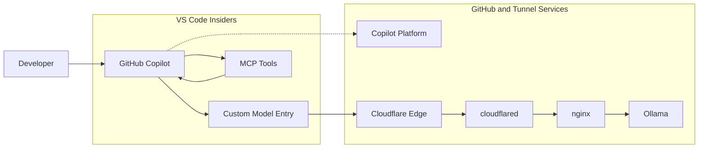

# AI Tunnel Example Repo

This repo provides a working example scaffold for exposing an Ollama server through Cloudflare Tunnel, fronting it with Nginx, and consuming it from VS Code Insiders through GitHub Copilot's OpenAI-compatible bring-your-own-model path.

## What This Stack Does

- runs Ollama privately on the internal Docker network
- fronts Ollama with Nginx
- protects the machine API route with bearer-token auth loaded from file
- optionally protects the admin hostname with Nginx Basic Auth loaded from file
- publishes the Nginx service through Cloudflare Tunnel
- keeps configuration in `.env`, using [example.env](example.env) as the contract

## Architecture

Traffic flow:

`Cloudflare -> cloudflared -> nginx -> ollama`

The API and admin surfaces are intentionally split:

- `OLLAMA_API_HOSTNAME` is the machine-facing route for VS Code and other API clients
- `OLLAMA_ADMIN_HOSTNAME` is the human-facing route for diagnostics and optional Basic Auth access

This matters because VS Code Insiders expects an API endpoint and API key for OpenAI-compatible models. A browser-style login flow in front of `/v1` would be the wrong fit.

## Stack Diagram



Operational split:

- model inference goes through `Cloudflare -> cloudflared -> nginx -> ollama`
- MCP tool calls are separate from the Ollama inference path and stay attached to Copilot in VS Code
- Copilot platform features like sign-in, policy, indexing, and side requests still exist alongside the custom model path

## Default Model

The default model profile for this repo is `DeepSeek V2 Lite`.

The current example uses this Ollama package as the backing model:

- display name: `DeepSeek V2 Lite`
- actual Ollama model id: `deepseek-v2:16b-lite-chat-q4_K_M`

Important distinction:

- the display name shown in VS Code can be friendlier than the backing package name
- the model id sent over the OpenAI-compatible API must match the Ollama model id unless you add a translation layer

This repo does not add a model-id translation proxy, so VS Code configuration should use `deepseek-v2:16b-lite-chat-q4_K_M` as the model id.

## Repo Layout

```text
.
|-- README.md
|-- example.env
|-- compose.yaml
|-- compose.gpu.yaml
|-- compose.amd.yaml
|-- compose.vulkan.yaml
|-- mempalace.yaml
|-- docs/
|   `-- vscode-insiders-setup.md
|-- nginx/
|   |-- nginx.conf
|   |-- conf.d/
|   |   `-- ollama.conf.template
|   `-- entrypoint/
|       `-- render-config.sh
`-- scripts/
    |-- bootstrap-workspace-memory.py
    |-- bootstrap-secrets.py
    |-- bootstrap-vscode-user.py
    |-- check-accel.py
    |-- rotate-api-token.py
    |-- smoke-test.ps1
    `-- smoke-test.sh
```

## Required Secrets

Create a sibling `ai-tunnel-secrets` directory one level up from the repo:

```text
../ai-tunnel-secrets/
|-- cloudflared-token
|-- nginx-admin-password
|-- ollama-api-token
`-- nginx-htpasswd
```

Secret usage:

- `cloudflared-token` is mounted into the `cloudflared` container and used as the tunnel token file
- `nginx-admin-password` is the plaintext source of truth for admin Basic Auth
- `ollama-api-token` is read by Nginx and enforced on the API hostname
- `nginx-htpasswd` is the derived hash file used only when `ENABLE_ADMIN_BASIC_AUTH=true`

## Quick Start

Fast path for a fresh clone:

1. Copy [example.env](example.env) to `.env` and update the public hostnames.
2. Run the secrets bootstrap so the sibling `../ai-tunnel-secrets` directory and local token files exist.
3. Start the stack and pull the default lite chat model.
4. Bootstrap VS Code user settings so Copilot sees the `AI Tunnel` provider.
5. On a machine that can host the larger package, configure the prewired `DeepSeek Math V2 Large (IQ1_S)` agent profile.
6. Run the smoke tests.

Windows PowerShell:

```powershell
Copy-Item example.env .env
py -3 scripts/bootstrap-secrets.py --env-file .env
docker compose --env-file .env up -d
docker compose --env-file .env --profile init run --rm ollama-pull
py -3 scripts/bootstrap-vscode-user.py --env-file .env --copy-api-key
py -3 scripts/modelctl.py add \
    --env-file .env \
    --settings-file .vscode/settings.json \
    --model-id milkey/deepseek-v2.5-1210:IQ1_S \
    --display-name "DeepSeek Math V2 Large (IQ1_S)" \
    --max-input-tokens 4096 \
    --max-output-tokens 4096 \
    --tool-calling true \
    --thinking true \
    --streaming true \
    --env-slot agent \
    --set-default true \
    --pull true
./scripts/smoke-test.ps1 --chat
./scripts/smoke-test.ps1 --tool-calling
```

POSIX shell:

```sh
cp example.env .env
python3 scripts/bootstrap-secrets.py --env-file .env
docker compose --env-file .env up -d
docker compose --env-file .env --profile init run --rm ollama-pull
python3 scripts/bootstrap-vscode-user.py --env-file .env --copy-api-key
python3 scripts/modelctl.py add \
    --env-file .env \
    --settings-file .vscode/settings.json \
    --model-id milkey/deepseek-v2.5-1210:IQ1_S \
    --display-name "DeepSeek Math V2 Large (IQ1_S)" \
    --max-input-tokens 4096 \
    --max-output-tokens 4096 \
    --tool-calling true \
    --thinking true \
    --streaming true \
    --env-slot agent \
    --set-default true \
    --pull true
./scripts/smoke-test.sh --chat
./scripts/smoke-test.sh --tool-calling
```

Task-first alternative in VS Code:

1. Run `Stack: Bootstrap Secrets`.
2. Run `Stack: Start Local Services`.
3. Run `Stack: Pull Default Model`.
4. Run `VS Code: Bootstrap User Space + Copy API Key`.
5. Run `Models: Configure DeepSeek Math V2 Large Agent`.
6. Run `Stack: Smoke Test` and `Stack: Smoke Test Tool Calling`.

Public repo hygiene:

- keep `.env` local and treat [example.env](example.env) as the documented contract
- do not commit `.data/`, `.copilot-bridge/`, or the generated `.vscode/mcp.json`
- keep secrets in the sibling `../ai-tunnel-secrets` directory, not in the repo

## Setup Guide

### 1. Prepare the environment file

Copy [example.env](example.env) to `.env` and set the values for your environment.

At minimum, review:

- `OLLAMA_API_HOSTNAME`
- `OLLAMA_ADMIN_HOSTNAME`
- `OLLAMA_API_PUBLIC_URL`
- `OLLAMA_ADMIN_PUBLIC_URL`
- `CF_TUNNEL_TOKEN_FILE`
- `OLLAMA_MODEL`
- `OLLAMA_MODEL_DISPLAY_NAME`
- `OLLAMA_MODEL_VSCODE_ID`

### 2. Create the required secret files

Use the bootstrap helper to create the sibling `../ai-tunnel-secrets` directory, generate the Nginx secrets, and create an empty Cloudflare tunnel token placeholder.

Windows:

```powershell
py -3 scripts/bootstrap-secrets.py --env-file .env
```

POSIX shell:

```sh
python3 scripts/bootstrap-secrets.py --env-file .env
```

You can also run the `Stack: Bootstrap Secrets` task from the Command Palette.

If you need to rotate the bearer token later, use the dedicated helper so the token file and Nginx stay in sync:

```powershell
py -3 scripts/rotate-api-token.py --env-file .env --copy-to-clipboard
```

That command rewrites `../ai-tunnel-secrets/ollama-api-token`, restarts `nginx`, and copies the new token to your clipboard so you can paste it back into `Chat: Manage Language Models`.

That bootstrap creates or preserves:

- `cloudflared-token`
- `nginx-admin-password`
- `ollama-api-token`
- `nginx-htpasswd`

Notes:

- the API token is for the machine-facing `/v1` route used by VS Code
- `cloudflared-token` must contain the Cloudflare tunnel token text, not a JSON credentials document
- `nginx-admin-password` is the file you manage directly for admin Basic Auth
- `nginx-htpasswd` is regenerated from `nginx-admin-password` and used only for the admin hostname when `ENABLE_ADMIN_BASIC_AUTH=true`
- if you change `nginx-admin-password`, rerun the bootstrap helper so the derived `nginx-htpasswd` stays in sync
- rerun with `--force` if you want the helper to rotate the stored admin password automatically
- `cloudflared-token` is created as an empty placeholder and must be replaced with the real Cloudflare tunnel token before starting the `tunnel` profile

### 3. Configure the Cloudflare dashboard routes

This repo now assumes a remotely managed Cloudflare Tunnel using a token file. That means the hostname routing is configured in the Cloudflare dashboard, not in a local `cloudflared` ingress file.

For the screenshot you attached, create two `Published applications` routes, both pointing at the `nginx` service inside the Docker network.

Route 1: API hostname

- `Hostname > Subdomain`: the left-most label from `OLLAMA_API_HOSTNAME`
- `Hostname > Domain`: the remaining domain from `OLLAMA_API_HOSTNAME`
- `Path`: leave empty
- `Service > Type`: `HTTP`
- `Service > URL`: `http://nginx:${NGINX_LISTEN_PORT}`

With the default `.env`, that means:

- subdomain: `ollama-api`
- domain: `example.com`
- service URL: `http://nginx:8080`

Route 2: admin hostname

- `Hostname > Subdomain`: the left-most label from `OLLAMA_ADMIN_HOSTNAME`
- `Hostname > Domain`: the remaining domain from `OLLAMA_ADMIN_HOSTNAME`
- `Path`: leave empty
- `Service > Type`: `HTTP`
- `Service > URL`: `http://nginx:${NGINX_LISTEN_PORT}`

With the default `.env`, that means:

- subdomain: `ollama-admin`
- domain: `example.com`
- service URL: `http://nginx:8080`

Important:

- because `cloudflared` runs in Docker beside `nginx`, the origin URL is `nginx:${NGINX_LISTEN_PORT}`, not `localhost:${NGINX_LISTEN_PORT}`
- you do not need a path for this setup; leave it blank so the whole hostname is forwarded
- the token for this tunnel should be stored in `../ai-tunnel-secrets/cloudflared-token`

### 4. Start the local stack and pull the default model

CPU-only or portable default:

Windows:

```powershell
docker compose --env-file .env up -d
docker compose --env-file .env --profile init run --rm ollama-pull
```

POSIX shell:

```sh
docker compose --env-file .env up -d
docker compose --env-file .env --profile init run --rm ollama-pull
```

If you want Ollama to use an accelerator, run the matching preflight check first and then use the matching overlay.

NVIDIA on Windows or Linux:

Windows:

```powershell
py -3 scripts/check-accel.py --env-file .env --provider nvidia
docker compose -f compose.yaml -f compose.gpu.yaml --env-file .env up -d
docker compose -f compose.yaml -f compose.gpu.yaml --env-file .env --profile init run --rm ollama-pull
```

POSIX shell:

```sh
python3 scripts/check-accel.py --env-file .env --provider nvidia
docker compose -f compose.yaml -f compose.gpu.yaml --env-file .env up -d
docker compose -f compose.yaml -f compose.gpu.yaml --env-file .env --profile init run --rm ollama-pull
```

AMD ROCm on Linux:

```sh
python3 scripts/check-accel.py --env-file .env --provider amd
docker compose -f compose.yaml -f compose.amd.yaml --env-file .env up -d
docker compose -f compose.yaml -f compose.amd.yaml --env-file .env --profile init run --rm ollama-pull
```

Intel or other Vulkan-backed GPUs on Linux:

```sh
python3 scripts/check-accel.py --env-file .env --provider vulkan
docker compose -f compose.yaml -f compose.vulkan.yaml --env-file .env up -d
docker compose -f compose.yaml -f compose.vulkan.yaml --env-file .env --profile init run --rm ollama-pull
```

### 5. Optionally publish the stack through Cloudflare Tunnel

After the dashboard routes exist and `../ai-tunnel-secrets/cloudflared-token` contains the tunnel token, start the `tunnel` profile.

Windows:

```powershell
docker compose --env-file .env --profile tunnel up -d cloudflared
```

POSIX shell:

```sh
docker compose --env-file .env --profile tunnel up -d cloudflared
```

### 6. Configure VS Code Insiders for the custom model

Recommended fast path from this repo:

Windows PowerShell:

```powershell
py -3 scripts/bootstrap-vscode-user.py --env-file .env --copy-api-key
```

POSIX shell:

```sh
python3 scripts/bootstrap-vscode-user.py --env-file .env --copy-api-key
```

You can also run `VS Code: Bootstrap User Space` or `VS Code: Bootstrap User Space + Copy API Key` from the Command Palette.

In VS Code Insiders:

1. Sign in to GitHub Copilot.
2. Run the bootstrap helper or task so the repo can register the model and provider in your user profile.
3. Reload the VS Code window if it was already open.
4. Open the Chat view.
5. Run `Chat: Manage Language Models`.
6. Select the `AI Tunnel` provider if it already exists, or add an `OpenAI Compatible` provider if you skipped the bootstrap helper.
7. Paste the API key from `../ai-tunnel-secrets/ollama-api-token` if prompted.
8. Make sure the model id matches `OLLAMA_MODEL_VSCODE_ID`.
9. Select the model from the chat model picker.

Important:

- the bootstrap helper updates your VS Code user `settings.json` and `chatLanguageModels.json`, not just the workspace copy
- the API key itself is stored by VS Code in secure storage, so the supported automation boundary is copying the token to your clipboard instead of writing it into JSON
- the display name can be friendly
- the model id must match the actual Ollama model id unless you add a rewriting layer in front of Ollama

The workspace model entry lives in [.vscode/settings.json](.vscode/settings.json), and the detailed model setup notes are in [docs/vscode-insiders-setup.md](docs/vscode-insiders-setup.md).

### 7. Configure MCP tools in Copilot

If you want Copilot to use MCP tools alongside the tunneled Ollama model:

1. Run the `Workspace Memory: Bootstrap Bridge` task if you want repo-local workspace memory.
2. Run `Workspace Memory: Bootstrap Bridge + Palace` if you also want MemPalace initialized, mined, and smoke-tested for this workspace.
3. Reload the VS Code window after the bootstrap task updates `.vscode/mcp.json` and `.vscode/tasks.json`.
4. Confirm `workspaceMemoryBridge` appears in the MCP server list.
5. Use the bridge alongside any other MCP servers you want in chat or agent mode.

Important separation:

- MCP tool calls do not go through the Ollama tunnel path
- model generation still goes through `Cloudflare -> cloudflared -> nginx -> ollama`
- the memory bridge MCP endpoint is local to the workspace and is generated per clone because its localhost port is derived from the workspace path

This repo now promotes `workspace-memory-bridge` as the default memory-oriented MCP integration. The bootstrap wrapper at [scripts/bootstrap-workspace-memory.py](scripts/bootstrap-workspace-memory.py) prefers a sibling checkout at `../workspace-memory-bridge` and falls back to the public package when needed.

### 8. Validate the stack

Run the smoke tests after startup:

Windows:

```powershell
./scripts/smoke-test.ps1
```

POSIX shell:

```sh
./scripts/smoke-test.sh
```

Add `--chat` if you want to test a streaming chat completion after the model has been pulled.

Add `--tool-calling` if you want to verify that the current agent profile can emit an OpenAI-style function call through the tunnel. The smoke helper prefers `OLLAMA_AGENT_MODEL` when that optional profile is configured and falls back to `OLLAMA_MODEL` otherwise.

## Model Management Tooling

The repo now includes a model-management tool in [scripts/modelctl.py](scripts/modelctl.py) and a VS Code task in [.vscode/tasks.json](.vscode/tasks.json).

Use it when you want to add a new model in both places that matter here:

- Ollama, by optionally pulling the model into the local model store
- VS Code, by writing the matching `github.copilot.chat.customOAIModels` entry into [.vscode/settings.json](.vscode/settings.json)

Recommended split for Copilot:

- keep `DeepSeek V2 Lite` as the default chat profile with `toolCalling=false`
- use the preconfigured `OLLAMA_AGENT_*` profile for `DeepSeek Math V2 Large (IQ1_S)` in agent mode with `toolCalling=true`
- let `modelctl.py` pull first and then probe tool calling before it writes that agent-capable profile unless you explicitly pass `--skip-tool-verification true`

Current limitation:

- the local `DeepSeek V2 Lite` package remains chat-only because the current Ollama build reports that it does not support tools

Example:

```powershell
py -3 scripts/modelctl.py add \
    --env-file .env \
    --settings-file .vscode/settings.json \
    --model-id deepseek-r1:8b \
    --display-name "DeepSeek R1 8B" \
    --max-input-tokens 32768 \
    --max-output-tokens 8192 \
    --tool-calling false \
    --thinking true \
    --streaming true \
    --set-default false \
    --pull true
```

Agent-profile example:

```powershell
py -3 scripts/modelctl.py add \
    --env-file .env \
    --settings-file .vscode/settings.json \
    --model-id milkey/deepseek-v2.5-1210:IQ1_S \
    --display-name "DeepSeek Math V2 Large (IQ1_S)" \
    --max-input-tokens 4096 \
    --max-output-tokens 4096 \
    --tool-calling true \
    --thinking true \
    --streaming true \
    --env-slot agent \
    --set-default true \
    --pull true
```

That path now pulls the model into Ollama first, then verifies tool calling through the local Nginx route, and only then writes `toolCalling=true` into the registered model entry.

If you prefer the editor workflow, run the `Models: Add Or Update Model` task from the Command Palette.

If you want the repo-managed agent slot instead of a one-off model entry, run `Models: Configure DeepSeek Math V2 Large Agent` for the default large-profile setup or `Models: Add Or Update Agent Model` for another tool-capable Ollama model id.

For user-space registration, use [scripts/bootstrap-vscode-user.py](scripts/bootstrap-vscode-user.py) or the `VS Code: Bootstrap User Space` tasks. That helper updates the user-level provider metadata in `chatLanguageModels.json`, mirrors the model definition into user settings, and can copy the API token from `../ai-tunnel-secrets/ollama-api-token` to the clipboard for the final secure-storage step.

For token rotation after initial setup, use [scripts/rotate-api-token.py](scripts/rotate-api-token.py) or the `Stack: Rotate API Token` tasks. Nginx renders the bearer token into its generated include files at container startup, so rotating this secret requires an `nginx` restart. The helper handles that restart for you and can copy the new token to the clipboard for the VS Code secure-storage update.

## Workspace Memory Bridge

This repo can pair Copilot with a local `workspaceMemoryBridge` MCP server backed by MemPalace.

Recommended path:

- run `Workspace Memory: Bootstrap Bridge` to install or reuse `workspace-memory-bridge` and scaffold `.vscode/mcp.json`, the folder-open startup task, and the required settings
- run `Workspace Memory: Bootstrap Bridge + Palace` if you want the same setup plus MemPalace initialization, initial mining, and an HTTP smoke test
- keep [mempalace.yaml](mempalace.yaml) checked in so the bridge starts with repo-specific rooms for infrastructure, docs, scripts, and VS Code config

The bootstrap flow is intentionally local-first. If a sibling checkout exists at `../workspace-memory-bridge`, it installs that editable package. Otherwise it can fall back to the public GitHub package.

## GPU Acceleration And Performance

The base [compose.yaml](compose.yaml) is intentionally CPU-safe. Accelerator access is enabled through overlays so the default stack stays portable.

Overlay matrix:

- [compose.gpu.yaml](compose.gpu.yaml): NVIDIA via Docker `gpus: all`, practical on Windows or Linux when NVIDIA container support is working
- [compose.amd.yaml](compose.amd.yaml): AMD ROCm via `ollama/ollama:rocm` plus `/dev/kfd` and `/dev/dri`, Linux host only
- [compose.vulkan.yaml](compose.vulkan.yaml): experimental Vulkan path for Intel GPUs and other Vulkan-backed devices, Linux host only

The repository also includes [scripts/check-accel.py](scripts/check-accel.py) and matching VS Code tasks in [.vscode/tasks.json](.vscode/tasks.json) so you can verify the Docker passthrough path before startup.

The defaults in [example.env](example.env) are tuned for the common single-user Copilot case:

- `OLLAMA_FLASH_ATTENTION=true` to reduce memory pressure on supported GPUs
- `OLLAMA_NUM_PARALLEL=1` to avoid unnecessary VRAM contention
- `OLLAMA_MAX_LOADED_MODELS=1` to keep one active model resident without piling up extra loaded models

Host requirements for the GPU path:

- Docker Desktop with WSL2 GPU support, or Docker Engine with NVIDIA container support
- a working NVIDIA driver on the host
- a Docker installation that can run `docker run --gpus all ...`

Host requirements for the Linux-only paths:

- AMD ROCm overlay: a Linux host with ROCm-capable drivers and access to `/dev/kfd` and `/dev/dri`
- Vulkan overlay: a Linux host with working Vulkan drivers and access to `/dev/dri`

On Windows, this repo only models the NVIDIA Docker path. For AMD or Intel on Windows, native Ollama is the more realistic route today than Linux-container device passthrough through Docker Desktop.

If your machine does not satisfy the accelerator requirements, keep using [compose.yaml](compose.yaml) alone. The stack will still work on CPU, just more slowly.

## Compose Profiles

- default: `ollama` and `nginx`
- `init`: one-shot model pull through `ollama-pull`
- `tunnel`: `cloudflared`

This split makes local validation possible before you provide real Cloudflare credentials.

## Nginx Behavior

The Nginx config is shaped specifically for Copilot-compatible API traffic:

- `/v1/*` is proxied to Ollama's OpenAI-compatible API
- `/api/*` can optionally proxy the raw Ollama API
- `Authorization` is preserved upstream
- `proxy_buffering off` and `proxy_request_buffering off` are enabled
- long proxy read and send timeouts are configured
- unauthenticated API requests return JSON `401`
- the admin hostname can use Basic Auth without affecting the API hostname

## Cloudflare Tunnel Routing

This stack uses a remotely managed tunnel token, not a locally managed tunnel credentials file. In that model, Cloudflare hostname routing lives in the dashboard under `Published applications`, and the local connector just needs the token file.

For this Docker layout, every published application route should target the `nginx` service on the internal Docker network:

- type: `HTTP`
- origin URL: `http://nginx:${NGINX_LISTEN_PORT}`

Do not point the dashboard route at `localhost:${NGINX_LISTEN_PORT}` when `cloudflared` is running as a container. Inside the container, `localhost` is the `cloudflared` container itself, not `nginx`.

## Persistence

For persistence across container restarts, the important data mount is the Ollama model store:

- [compose.yaml](compose.yaml) mounts `./${OLLAMA_MODELS_PATH}` into `/root/.ollama`

That is what keeps downloaded models available after stopping and starting the stack.

The other mounts are configuration and secret mounts, not application-state persistence:

- Nginx mounts templates and secret files from the host
- cloudflared mounts the rendered config and tunnel credentials from the host

Those files already persist because they live on the host filesystem. They do not need Docker-managed volumes.

If you want model persistence to survive repo cleanup as well as container restart, point `OLLAMA_MODELS_PATH` at a location outside the repository or convert it to a named Docker volume.

## Validation

The scaffold has already been checked with:

```sh
docker compose --env-file example.env config
```

You can use the included smoke tests after startup:

- [scripts/smoke-test.ps1](scripts/smoke-test.ps1)
- [scripts/smoke-test.sh](scripts/smoke-test.sh)

Add `--chat` if you want to test a streaming chat completion after the model has been pulled.

## VS Code Insiders

Use the API hostname and bearer token through the OpenAI-compatible BYOK path in VS Code Insiders.

The detailed setup steps and the correct model-id guidance are in [docs/vscode-insiders-setup.md](docs/vscode-insiders-setup.md).

Copilot can also use MCP tools in parallel with this model path. MCP tool calls remain separate from the Ollama inference route shown in the diagram above.

## Known Limits

- GitHub Copilot BYOK for local or self-hosted models only affects chat and inline chat, not inline suggestions.
- Using a local or self-hosted model still requires Copilot access and internet connectivity today.
- If the backing Ollama model does not support tool calling, it may not appear in agent mode even if it works in chat mode.
- This repo now treats that as a two-profile setup by default: a chat-first DeepSeek profile plus an optional separately verified agent profile.